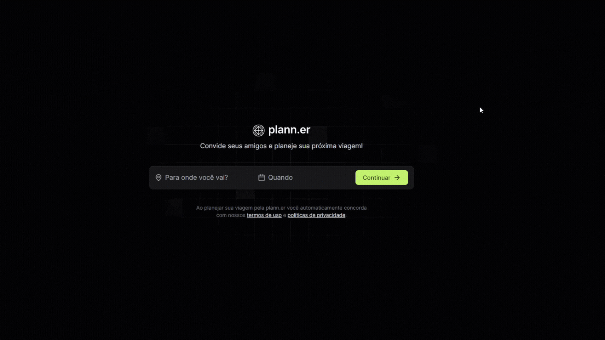

<br>

<div align='center'>
<h1 height='80p'>
    Travel Planner
</h1>
</div>

<h3 align="center" style='margin-bottom: 32px'>
  App utilizing React and Node.js/Fastify to plan and organize your trips efficiently.
</h3>



## 🚀 Technologies

- [React](https://react.dev/) - A JavaScript library for building user interfaces.
- [TypeScript](https://www.typescriptlang.org/) - Typed superset of JavaScript that compiles to plain JavaScript.
- [Tailwind CSS](https://tailwindcss.com/) - A utility-first CSS framework for rapid UI development.
- [Node](https://nodejs.org) - JavaScript runtime built on Chrome's V8 JavaScript engine.
- [Fastify](https://fastify.dev/) - A fast and low overhead web framework for Node.js.
- [Prisma](https://www.prisma.io/) - Next-generation ORM for Node.js and TypeScript.

## 🛠 Keys Features

- <b>Travel Itinerary Management: </b> Create and manage detailed travel itineraries with activities for each day.

- <b>User-Friendly Interface: </b> Enjoy a clean and intuitive user interface for seamless trip planning.

- <b>Flexible Activity Addition: </b> Easily add, edit, and remove activities from your travel plan.

## 📝 How to run

<h3>1. Clone the Repository </h3>

```console
git clone https://github.com/Pedro-Arruda/travel-planner.git

cd travel-planner
```

<h3>2. Set Up Environment Variables </h3> 
<p>Create a .env file in the root of your api directory and add the following environment variables </p>

```console
DATABASE_URL="file:./dev.db"

API_BASE_URL="http://localhost:3000"

WEB_BASE_URL="http://localhost:3333"

PORT=3333
```

<h3>3. Install Dependencies</h3> 
<p>Navigate to the API and client directories to install the dependencies </p>

```console
# Install dependencies for the API
cd api
yarn install

# Install dependencies for the client
cd ../client
yarn install
```

<h3>4. Start the Development Servers</h3> 
<p>Start the API and client development servers</p>

```console
# Start the API server
cd ../api
yarn dev

# Start the client server
cd ../client
yarn dev
```

<h3>5. Access the Application</h3> 
<p>Open your browser and navigate to http://localhost:3333 to access the Travel Planner application.</p>

<br>
<hr>

  <h3 align='center'> Developed By Pedro Arruda </h3> 
  <div align='center'> 
    <a href="mailto:dev.pedro.arruda@gmail.com"  title="Gmail" style='height: 40px'>
    </a>
    <a href="https://www.linkedin.com/in/pedro-scucuglia-arruda/" title="LinkedIn">
    </a>
    <a href="https://api.whatsapp.com/send?phone=14998861503" title="WhatsApp">
    </a>
  </div>

<h3 align='center'>Feel free to reach out for any questions or collaboration opportunities!
 </h3>
